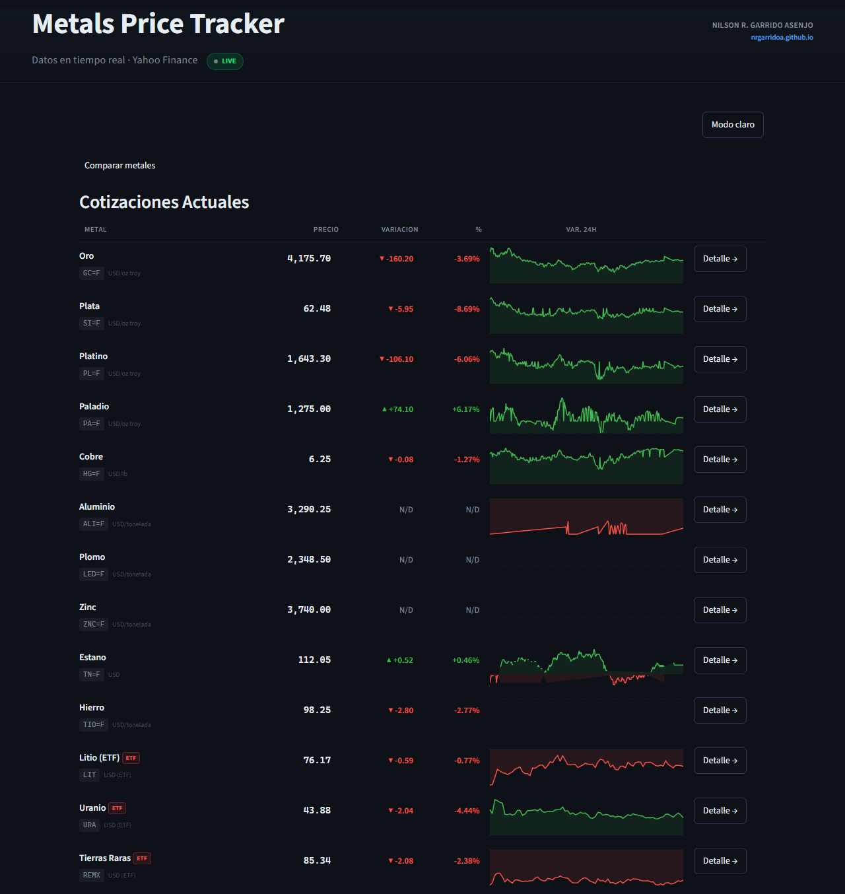
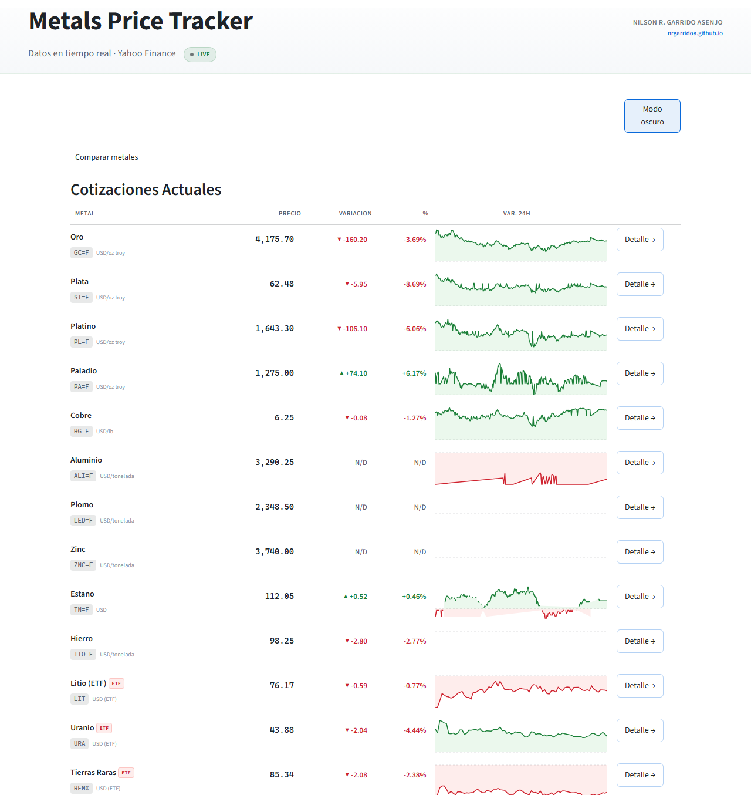
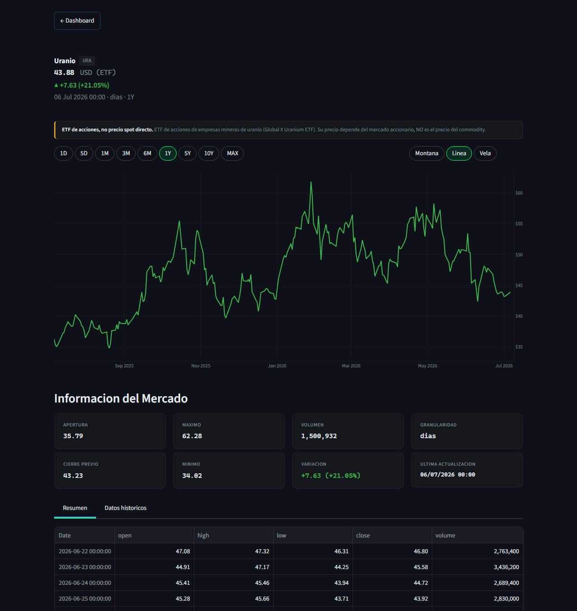
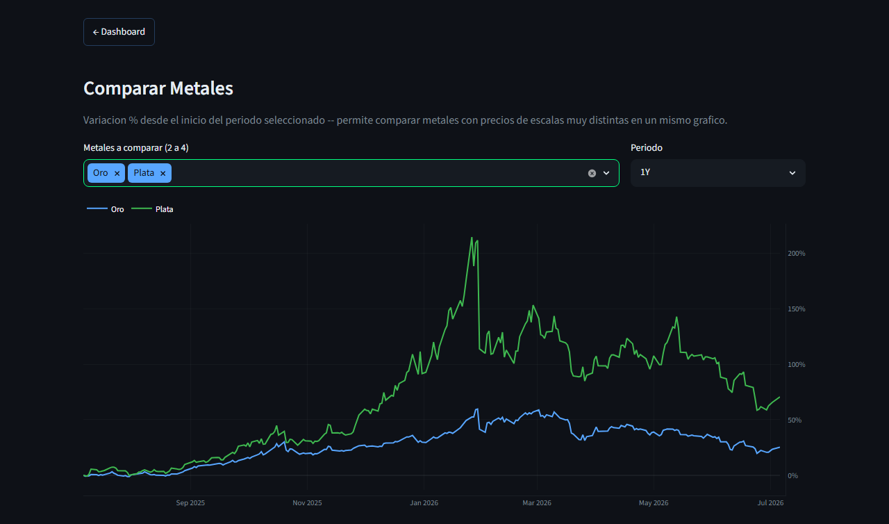

#### Si te resulta util este proyecto, apoyalo con un  en el repositorio.

---

# Metals Price Tracker - Dashboard de Precios de Metales en Tiempo Real

> **Cotizar metales no es tan simple como parece: de 14 instrumentos que suelen agruparse como "precio del metal", solo algunos son futuros que cotizan el commodity directamente. Otros son ETN atados a un subindice, y tres son ETF de acciones mineras cuyo precio depende del mercado accionario, no del commodity. Este dashboard hace esa diferencia explicita en vez de esconderla.**

Dashboard en tiempo real que rastrea 13 metales (preciosos, industriales y
estrategicos) con datos de Yahoo Finance, pensado para que el dato se pueda
interpretar correctamente: unidad de cotizacion real por instrumento, aviso
cuando el precio es un proxy y no el commodity, y honestidad sobre cuando
los datos vienen en vivo o de un respaldo local.

&nbsp;

---

## Vista previa

### Dashboard principal - tema oscuro y claro

| Tema oscuro | Tema claro |
|:---:|:---:|
|  |  |

### Detalle por metal, con aviso de transparencia en instrumentos proxy

### Comparacion normalizada de metales a distinta escala de precio

---

## Que problema resuelve

| Sin este dashboard | Con este dashboard |
|---|---|
| "Precio del metal" sin aclarar si es futuro, ETN o ETF de acciones | Unidad real (USD/oz troy, USD/lb, USD/tonelada) y badge ETN/ETF con la diferencia explicada |
| Comparar oro (~4000 USD/oz) y plata (~60 USD/oz) en un mismo grafico vuelve la de menor precio invisible | Comparacion normalizada a variacion % desde el inicio del periodo (misma convencion que usan Yahoo Finance y TradingView) |
| El indicador "en vivo" es fijo, sin reflejar si la fuente realmente respondio | Estado real: LIVE si Yahoo Finance respondio, o aviso de datos en cache si hubo que usar el respaldo local |
| Contratos de baja liquidez muestran variaciones que parecen reales pero son ruido de actualizacion | Se marcan como N/D en vez de mostrar un numero enganoso |
| Un link a un metal especifico no conserva el periodo ni el tipo de grafico | Estado (metal, periodo, tipo de grafico) reflejado en la URL, compartible tal cual |

---

## Hallazgos durante la construccion

Verificar la fuente de datos en vez de asumirla saco a la luz varios problemas reales:

**1. Tres de los proxies de metales base llevaban anos muertos sin que nadie lo notara**
- Los ETN de aluminio, niquel y zinc (JJU/JJN/JJZ) fueron redimidos por Barclays el 14/06/2023
- Yahoo Finance nunca volvera a servir datos para esos tickers
- Se reemplazaron aluminio y zinc por sus futuros COMEX directos (verificados en vivo), y se elimino niquel del dashboard al no existir un futuro equivalente en Yahoo Finance

**2. No todos los "metales" cotizan el commodity**
- 3 de 14 instrumentos (litio, uranio, tierras raras) son ETF de canastas de acciones de empresas mineras -- su precio depende del mercado accionario, no del commodity
- El dashboard ahora lo marca explicitamente en vez de presentarlos igual que un futuro real

**3. Los reemplazos de baja liquidez necesitaban su propio aviso**
- Los futuros COMEX de aluminio, plomo y zinc tienen actualizaciones muy espaciadas en Yahoo Finance (el precio puede quedar igual varios dias y saltar de golpe)
- Mostrar su variacion % como si fuera un movimiento real de mercado habria sido enganoso, asi que se marca como dato no disponible

---

## Metales disponibles

| Preciosos | Industriales | Estrategicos |
|-----------|-------------|-------------|
| Oro | Cobre | Litio (ETF) |
| Plata | Aluminio | Uranio (ETF) |
| Platino | Plomo | Tierras Raras (ETF) |
| Paladio | Zinc | |
| | Estano | |
| | Hierro | |

---

## Secciones del dashboard

### Cotizaciones actuales
Tabla con precio, unidad real de cotizacion, variacion, sparkline de 24h y badge
ETN/ETF con tooltip para instrumentos que no cotizan el commodity de forma directa.

### Vista de detalle por metal
Grafico interactivo (montana, linea o velas japonesas) con selector de periodo
de 1 dia a historico completo, tarjetas de informacion de mercado y descarga a CSV.
El estado (metal, periodo, tipo de grafico) se refleja en la URL para poder
compartir un link exacto.

### Comparar metales
Seleccion de 2 a 4 metales normalizados a variacion % desde el inicio del
periodo, para comparar activos de escalas de precio muy distintas en un mismo
grafico sin que el de menor precio quede invisible.

### Tema claro / oscuro
Paleta completa (incluyendo los graficos de Plotly) adaptada a ambos temas.

---

## Notas de arquitectura

| Aspecto | Detalle |
|---|---|
| **Fuente de datos** | Yahoo Finance via `yfinance`, con fallback a SQLite local si la fuente falla |
| **Actualizacion en Cloud** | Streamlit Community Cloud solo ejecuta la app Streamlit -- el scheduler de recoleccion periodica (APScheduler) y el historico en SQLite tienen efecto en un despliegue propio con almacenamiento persistente (Docker), no en la demo publica |
| **Cache** | TTL corto para vistas de corto plazo, TTL largo (12h) para periodos historicos que casi no cambian entre refrescos |
| **Tema** | Variables CSS con paleta oscura por defecto y override de paleta clara inyectado segun la sesion |
| **Tests** | Suite de pytest para el cliente de datos, la base de datos, el scheduler y utilidades, con CI en GitHub Actions |

---

## Stack tecnologico

| Herramienta | Uso |
|---|---|
| **Python** | Lenguaje base |
| **Streamlit** | Framework del dashboard |
| **Plotly** | Graficos interactivos (velas, sparklines, comparacion normalizada) |
| **yfinance** | Cliente de datos de Yahoo Finance |
| **Pandas** | Procesamiento de series de tiempo |
| **SQLite + APScheduler** | Historico y respaldo local (despliegue propio) |
| **pytest + GitHub Actions** | Tests automatizados y CI |
| **Docker** | Deployment containerizado alternativo |
| **Streamlit Community Cloud** | Hosting del demo en vivo |

---

## Autor

### Nilson Rolando Garrido Asenjo

**Mining Engineer | Data Analyst | Python Developer**

Ingeniero de Minas (UNC, primer puesto) y Administrador Industrial (SENATI) con
trayectoria en gran mineria, industria farmaceutica y manufactura de alimentos.
He liderado equipos de campo en Newmont Yanacocha, Gold Fields y Silver Mountain,
dirigido proyectos tecnologicos en CODE UNI y ejecutado consultoria de
reconciliacion de mineral para Chinalco y desarrollo de reporteria de seguridad
operativa (monitoreo de fatiga y somnolencia de flota) para Antamina.

Mi enfoque es transformar datos operativos en inteligencia para la toma de
decisiones, combinando experiencia de campo con herramientas como Power BI,
Python, SQL y DAX. Piloto de drones con operaciones en superficie (fotogrametria,
volumetria) y en subterranea (LiDAR con Elios 3 para Flyability). Docente de
Power BI y Python aplicado a mineria.

Formacion continua en Platzi, Coursera, iSE-Latam y Netzun en analitica de datos,
programacion, gestion agil de proyectos y tecnologias mineras.

---

## Sobre el codigo

Este es un **repositorio vitrina**: documenta la solucion y enlaza el demo en
vivo. El codigo de la aplicacion se mantiene en un repositorio privado para
proteger la implementacion. **Con gusto hago un recorrido por el codigo en una
entrevista tecnica o facilito el acceso bajo solicitud** -- escribeme por
[LinkedIn](https://www.linkedin.com/in/nrgarridoa) o
[correo](mailto:nrgarridoa@gmail.com).

---

(c) 2026 Nilson Rolando Garrido Asenjo -- Todos los derechos reservados. Ver [LICENSE](LICENSE).
